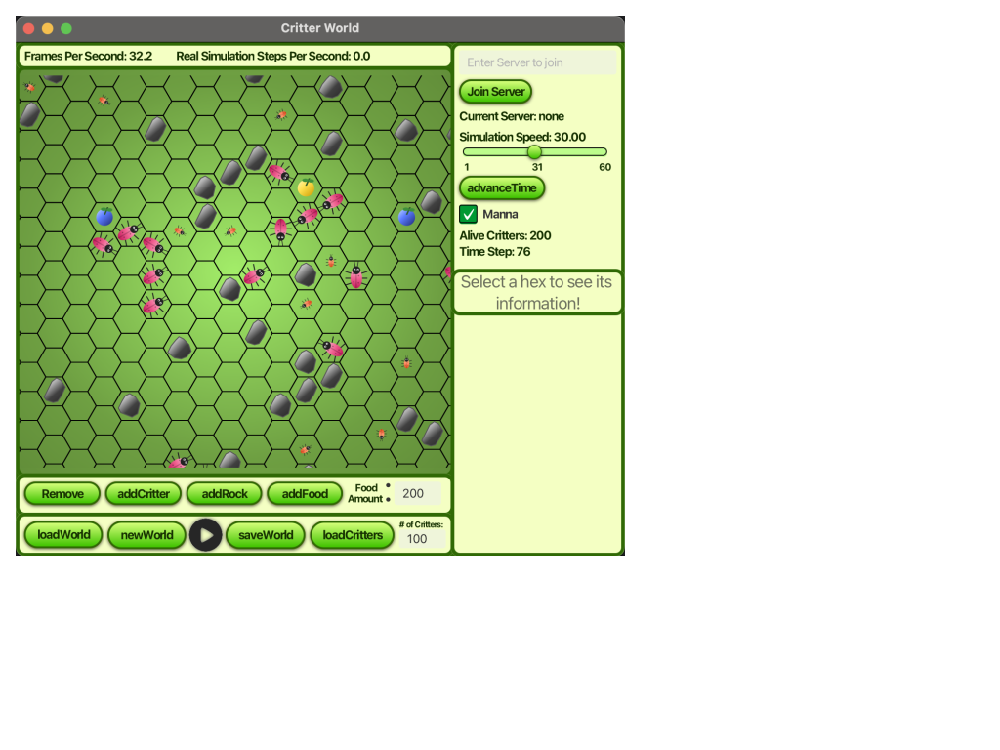
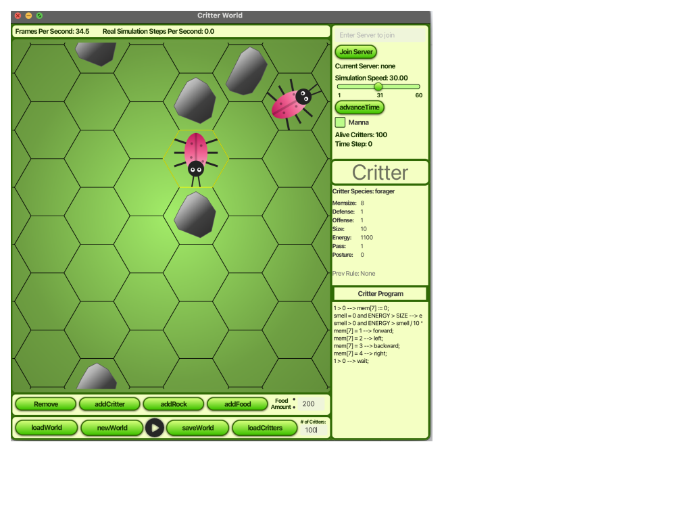

# critter-world-public

## [Video Demo](https://drive.google.com/file/d/1e_gTRRLz1gVjAqprA8WnM6X7f90X6SJe/view?usp=sharing)

Critter World project that simulates critters on a custom Critter language.

Features include:

- Distributed multi-client server built with Spark and Gson, allowing multiple users to interact with a shared world state
- Critter mutations that add unpredictability to the simulation
- Manna drops (food drops) that spawn food randomly around the map

## Screenshots:

